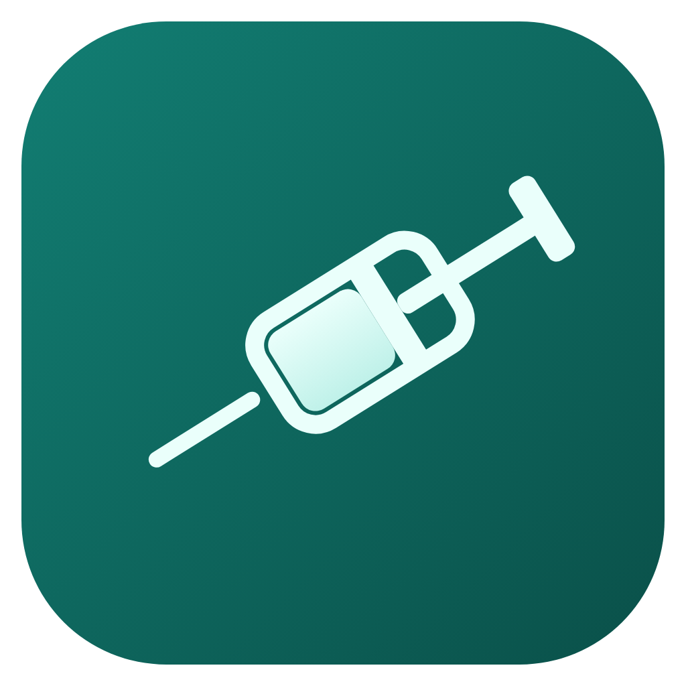

<p align="center">
  
</p>

<h1 align="center">Peptide Reconstitution Calculator</h1>

<p align="center">
  A self-contained, dependency-free calculator that converts vial mg, diluent volume and target dose into syringe units, injection volume, concentration and doses per vial.
</p>

<p align="center">
  <a href="https://calc.peptidesdirect.io"></a>
  
  
</p>

## Live demo

[calc.peptidesdirect.io](https://calc.peptidesdirect.io)

## Embed

Drop this snippet into any page. It is a single `<iframe>`, no scripts or stylesheets to load, no build step.

```html
<iframe src="https://calc.peptidesdirect.io" width="100%" height="720" style="border:0;max-width:920px" title="Peptide Reconstitution Calculator" loading="lazy"></iframe>
```

You can also self-host it: `index.html` is a single file with no external requests, so copying it (plus `peptides.json` if you want the bundled reference dataset) onto your own domain works with no configuration changes.

## Features

- Interactive U-100 syringe graphic: drag the plunger or use arrow keys to set the dose
- Live readouts for units, injection volume, concentration, and doses per vial as you change mg, water, or dose
- Blend breakdown for multi-peptide vials, with a per-component bar chart of the mix
- Dependency-free: one HTML file, no npm install, no CDN calls, no tracking
- Embeddable anywhere via `<iframe>`, or self-hosted as a static file
- Light and dark mode, following the embedding page's `prefers-color-scheme`

## How the math works

The calculator assumes a standard U-100 insulin syringe, where 100 units equal 1 ml (1 unit = 0.01 ml). All figures come from three inputs: vial content in mg, diluent (water) volume in ml, and the desired dose.

- Concentration (mg/ml) = vial mg / water ml
- Units for a dose = (dose / concentration) x 100
- Doses per vial = vial mg / dose

No other assumptions or corrections are applied. The tool does the arithmetic; it does not evaluate whether a given dose is appropriate.

## Reference data

`peptides.json` is a bundled, optional dataset of identity and handling reference values (molecular weight with PubChem CID citation, typical vial size, diluent type, reconstitution pH class, and storage handling) for a set of common research peptides. It contains no purity, potency, quality, or dosing data. Every molecular-weight value is cited to its PubChem entry. The dataset is licensed separately under CC BY 4.0 (see License below).

## Disclaimer

This calculator is a research and education reference tool. It performs unit-conversion arithmetic (mg, ml, syringe units) and does not recommend, imply, or validate any dose. Nothing in this repository, the calculator, or the bundled dataset constitutes medical advice, and none of it is intended for use in dosing humans or animals. Consult qualified professionals and applicable regulations for anything beyond arithmetic.

## Attribution

Maintained by [peptidesdirect.io](https://peptidesdirect.io). The embedded widget carries a small "Powered by" link back to the project; please keep it intact when embedding.

## License

- Code (`index.html`, this repository's tooling and documentation): [MIT](LICENSE)
- Data (`peptides.json`): [CC BY 4.0](https://creativecommons.org/licenses/by/4.0/)
