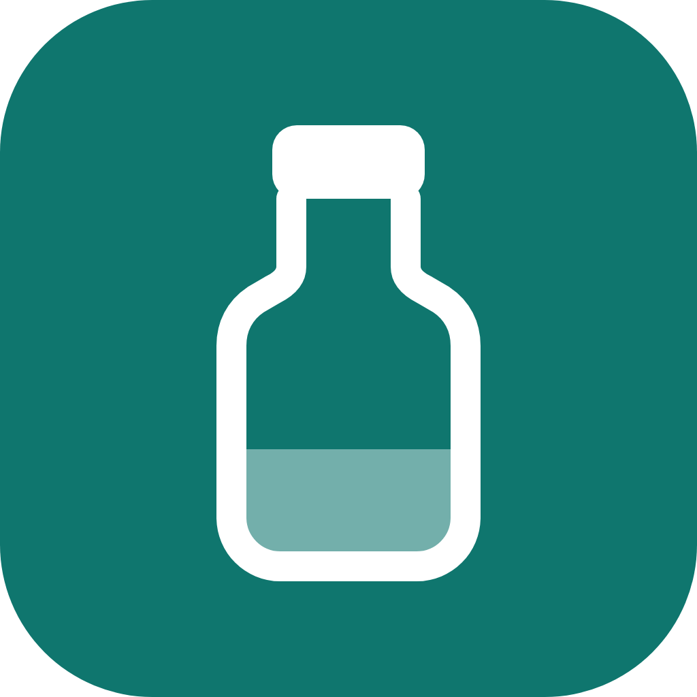
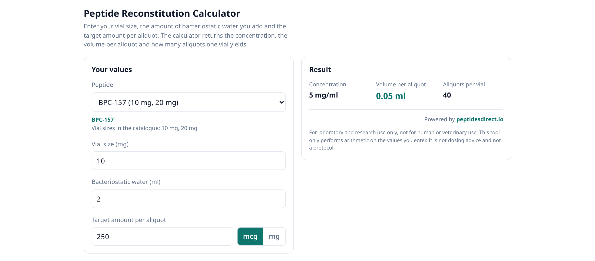

<p align="center">
  
</p>

<h1 align="center">Peptide Reconstitution Calculator</h1>

<p align="center">
  A TypeScript + Vite calculator that turns vial mg, bacteriostatic water in ml and a target amount per aliquot into concentration, volume per aliquot and aliquots per vial. Builds to one self-contained, dependency-free static HTML file.
</p>

<p align="center">
  <a href="https://github.com/peptidesdirect-io/peptide-reconstitution-calculator/actions/workflows/ci.yml"></a>
  <a href="https://calc.peptidesdirect.io"></a>
  
  <a href="LICENSE"></a>
  <a href="https://creativecommons.org/licenses/by/4.0/"></a>
  
  
</p>

<p align="center">
  
</p>

## What it is

Three inputs, three outputs. You enter:

1. the vial size in mg,
2. how much bacteriostatic water you add in ml,
3. the target amount per aliquot (mcg or mg).

You get:

1. the concentration in mg/ml,
2. the volume per aliquot in ml,
3. how many whole aliquots one vial yields.

For a blend (GLOW, KLOW, the CJC-1295 / Ipamorelin mix and so on) the result also splits one aliquot across the blend's components, so you can see how much of each peptide a given volume contains. The bundled dataset (`src/peptides.json`) carries the identity of each peptide plus the vial sizes it is sold in, nothing else.

Source code is TypeScript, built with Vite. There are no runtime dependencies: the production build is a single `dist/index.html` file with all JS and CSS inlined, so it can be self-hosted, embedded, or dropped onto any static host with zero configuration.

## Live demo

[calc.peptidesdirect.io](https://calc.peptidesdirect.io)

## Embed

Drop this snippet into any page. It loads the single built file, no other scripts or stylesheets required.

```html
<iframe src="https://calc.peptidesdirect.io" width="100%" height="640" style="border:0;max-width:920px" title="Peptide Reconstitution Calculator" loading="lazy"></iframe>
```

## Preselect a peptide with `?peptide=`

Append `?peptide=<slug>` to preselect an entry from the bundled dataset, e.g. `https://calc.peptidesdirect.io/?peptide=bpc-157`. That sets the dropdown and fills the vial field with the first catalogue vial size; the water volume keeps its default and the target amount stays empty. An unknown slug is ignored. The full list of slugs is in `src/peptides.json`.

## Fork and make it your own

1. Fork this repository.
2. `npm install`
3. Edit `src/peptides.json`: change which peptides are listed, their vial sizes, or a blend composition. The shape of each entry is documented in `src/peptides.ts` (the `Peptide` interface) and in [CONTRIBUTING.md](CONTRIBUTING.md).
4. `npm run build`
5. Deploy the contents of `dist/` (a single self-contained `index.html`) to your own domain.

Nothing else needs to change: branding, colours and copy live in `src/style.css` and `src/main.ts` if you want to customize further.

## Develop

```bash
npm install
npm run dev
```

Opens a local dev server with hot reload. `npm run typecheck` runs `tsc --noEmit` in strict mode.

## Deploy

This repo includes a GitHub Actions workflow (`.github/workflows/deploy.yml`) that builds and deploys `dist/` to GitHub Pages on every push to `main`. Enable Pages (Settings -> Pages -> Source: GitHub Actions) and it will publish automatically.

You can equally deploy `dist/` to Netlify, Vercel, Cloudflare Pages, or any static host: run `npm run build` and upload the single `dist/index.html`.

## How the math works

Everything follows from the three values you type in:

- Concentration (mg/ml) = vial mg / water ml
- Volume per aliquot (ml) = target amount mg / concentration
- Aliquots per vial = vial mg / target amount mg, rounded down

No other assumptions or corrections are applied. The tool does the arithmetic; it does not evaluate whether a given amount is appropriate. The pure math lives in `src/calc.ts`, independent of the DOM, so it is easy to audit or reuse.

## Data

`src/peptides.json` is a bundled, editable dataset. Per entry it holds:

- **Identity**: `molecularWeightDa` and `pubchemCid`, cited to the PubChem record they come from in the entry's `sources` array. Where a compound is not a single defined molecule (a thymus polypeptide fraction, an engineered analog without its own PubChem record, a blend), both fields are `null` and a `note` explains why, instead of an invented number.
- **Catalogue vial sizes**: `typicalVialMg`, the sizes the peptide is sold in, ascending. The first entry is the smallest listed size, and for a blend it is the size the component composition is defined at.
- **Blend composition**: `components`, the per-peptide mg split at the base vial size `typicalVialMg[0]`, scaled proportionally for any larger listed size.

By design the dataset contains nothing else: no amounts to use, no water or handling recommendations, no purity, potency or quality claims. It is licensed separately under CC BY 4.0 (see License below) and can be freely edited when you fork this project.

## Disclaimer

For laboratory and research use only, not for human or veterinary use. This tool only performs arithmetic on the values you enter. It is not dosing advice and not a protocol.

## Contributing

See [CONTRIBUTING.md](CONTRIBUTING.md) for the project layout, how to add or edit a peptide, and pull request conventions.

## License

- Code (`src/` except `src/peptides.json`, `vite.config.ts`, this repository's tooling and documentation): [MIT](LICENSE)
- Data (`src/peptides.json`): [CC BY 4.0](https://creativecommons.org/licenses/by/4.0/)

## Attribution

Powered by [peptidesdirect.io](https://peptidesdirect.io). The widget carries a small "Powered by" link back to the project; please keep it intact when embedding.
